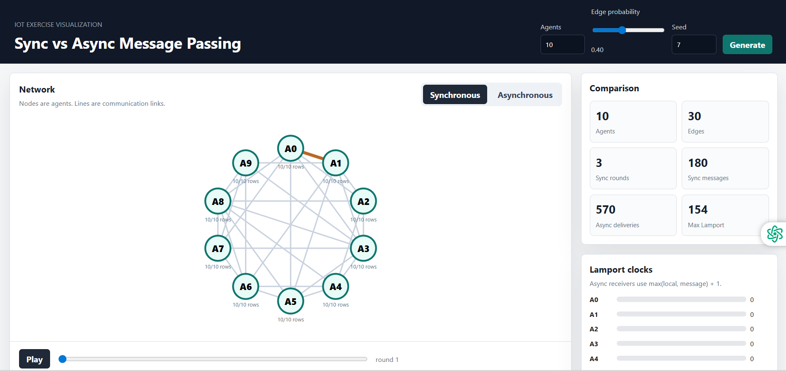
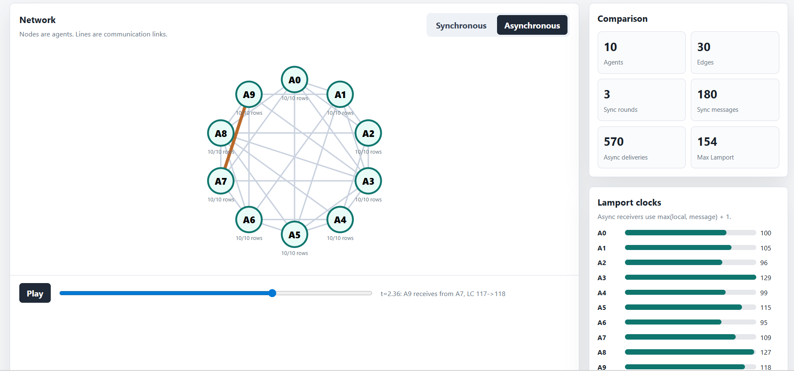

# IoT Network Simulation Visualization

A web visualization project for an IoT exercise about distributed agents.
The app shows how information spreads through a random network using both
synchronous and asynchronous message passing.

The goal of this project is to make the simulation easy to understand, easy to
run locally, and clear enough to present in class.

## Features

- Generate a random connected network of agents
- Choose the number of agents and edge probability
- Run a synchronous simulation
- Run an asynchronous simulation
- Visualize message flow on the network graph
- Show update-table convergence for each agent
- Display Lamport clock behavior in the asynchronous simulation
- Compare synchronous and asynchronous metrics

## Technologies Used

- Python 3
- Python standard library HTTP server
- HTML
- CSS
- JavaScript
- SVG for the network visualization

No database, Docker, Node.js, or frontend framework is required.

## Repository Structure

```text
.
├── agent.py
├── network.py
├── synchronous_simulator.py
├── asynchronous_simulator.py
├── main.py
├── app.py
├── static/
│   ├── index.html
│   ├── styles.css
│   └── app.js
├── screenshots/
│   ├── sync-view.png
│   ├── async-view.png.png
│   ├── event timeline.png
│   └── README.md
├── .gitignore
└── README.md
```

## Setup and Run

Clone the repository:

```bash
git clone https://github.com/urishar/IOT-simulaton-for-agents-network.git
cd IOT-simulaton-for-agents-network
```

Run the web app:

```bash
python app.py
```

Open the app in your browser:

```text
http://127.0.0.1:8000
```

Stop the server with `Ctrl+C`.

You can also run the console version:

```bash
python main.py
```

## How to Use the App

1. Choose the number of agents.
2. Choose the edge probability.
3. Click **Generate** to create a new network.
4. Switch between **Synchronous** and **Asynchronous** modes.
5. Press **Play** or use the timeline slider to inspect message events.
6. Watch the update tables, Lamport clocks, and comparison metrics change.

## Screenshots

The screenshots are stored in the `screenshots/` folder and displayed here so
they are visible from the main GitHub repository page.

### Synchronous view



### Asynchronous view



### Event timeline


## Future Improvements

- Add more simulation presets for demonstrations
- Export simulation results to JSON
- Add a short explanation panel inside the UI
- Improve mobile layout for smaller screens
- Add optional controls for animation speed

## Created By

Created as part of an IoT exercise project.
